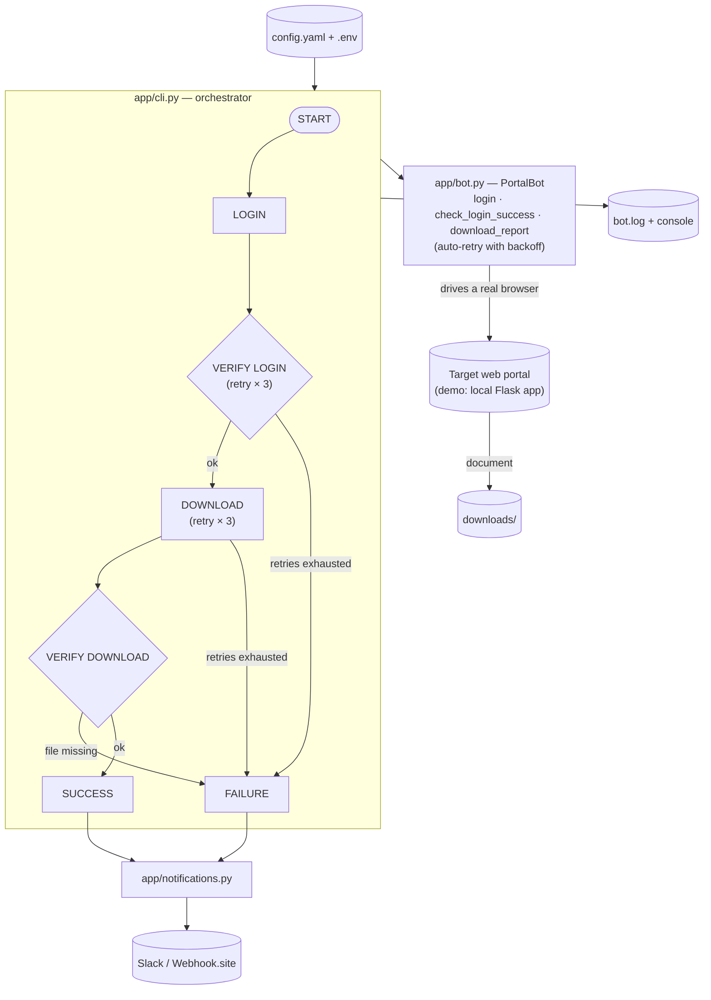

# Web Portal Automation Bot

A bot that logs into a website, retrieves a document, and alerts you if something goes wrong — no human intervention required.

## The problem

Many businesses have a recurring manual task: log into a portal (supplier extranet, admin platform, client area...), navigate to a document, download it. Every week or month, someone has to remember to do it, log in, and get it done — time taken away from higher-value work.

**Why isn't this already automated with a tool like Zapier or Make?** Those tools shine when a service exposes an API. But many private or legacy web portals (supplier extranets, administrative platforms, client areas) don't have an API or any native integration at all. In that case, browser automation is what lets you interact directly with the web interface, the way a human would — something only custom code can do.

## What this bot does

- Automatically logs into a portal with credentials
- Navigates to the target document and downloads it
- Verifies each step completed successfully before moving on
- Automatically retries when the site is temporarily slow
- Notifies you (Slack) after every run — success or failure — with the reason when something goes wrong
- Keeps a detailed log of every run, available for review at any time

## Reliability

This project includes an automated test suite that verifies the bot's behavior across different scenarios (successful login, incorrect credentials, temporarily unavailable site, interrupted download) — to ensure stable behavior in production, not just "it works on my machine."

## Slack notifications

The demo uses [Webhook.site](https://webhook.site) as a mock webhook endpoint, so both success and failure alerts can be observed without a real Slack workspace. In a production environment, this is replaced with a real Slack Incoming Webhook URL — no code changes required, just a different value in the environment configuration.

## Demo

The repository includes a reproducible demo portal: a login page, a protected area, and a document to download — so the bot can be observed in action without depending on a third-party site.

The bot can run with or without the browser window visible, useful for a live demo as well as unattended background execution.

## Architecture

Each run follows the same clear pipeline — login, verification, download, verification — with retries and status notifications built in rather than bolted on:

Configuration and secrets are fully external (`config.yaml`, `.env`) so the same code adapts to a new portal or client without modification. A companion demo portal (`demo_portal/`) reproduces a real login flow locally, so the whole pipeline can be observed end to end without depending on a third-party site.

## Deployment

The bot is packaged with Docker, ensuring consistent behavior across environments — development, production server, or a client's machine.

## Adapting to a new portal

Configuration (site address, elements to target) is fully separated from the code. Adapting the bot to a new portal requires no changes to the program itself — a real advantage for fast onboarding of a new client.

## Contact

Built by Hector Lequen — available for custom automation projects.