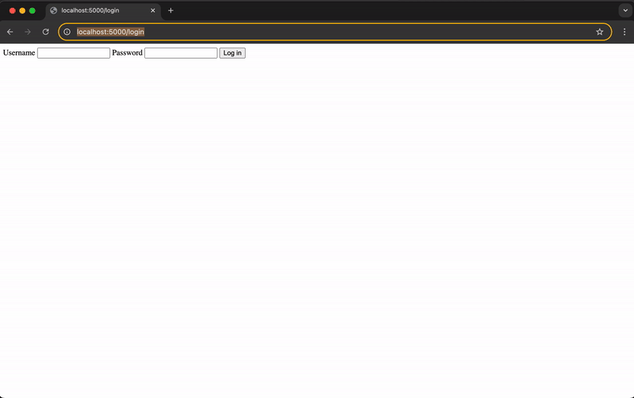

# Web Portal Automation Bot

A bot that logs into a website, retrieves a document, and alerts you if something goes wrong — no human intervention required.

> **"Replacing a manual, recurring login-and-download task with a reliable, automated bot."**

---

## The Problem

Many businesses have a recurring manual task: log into a portal (supplier extranet, admin platform, client area...), navigate to a document, download it. Every week or month, someone has to remember to do it, log in, and get it done — time taken away from higher-value work.

**Why isn't this already automated with a tool like Zapier or Make?** Those tools shine when a service exposes an API. But many private or legacy web portals (supplier extranets, administrative platforms, client areas) don't have an API or any native integration at all. In that case, browser automation is what lets you interact directly with the web interface, the way a human would — something only custom code can do.

---

## Features

- Automatic login to a portal with credentials
- Navigation to the target document and download
- Verification of each step before moving on
- Automatic retries when the site is temporarily slow
- Slack notification after every run — success or failure — with the reason when something goes wrong
- Detailed log of every run, available for review at any time
- Configuration fully external from the code (new portal = new config entry, no code change)

---

## Demo



The repository includes a reproducible demo portal: a login page, a protected area, and a document to download — so the bot can be observed end to end without depending on a third-party site.

The bot can run with or without the browser window visible, useful for a live demonstration as well as unattended background execution.

Slack notifications are demonstrated using [Webhook.site](https://webhook.site) as a mock endpoint. In a production environment, this is replaced with a real Slack Incoming Webhook URL — no code changes required, just a different value in the environment configuration.

---

## Installation

```bash
git clone https://github.com/hectorlequen/portal-automation-bot.git
cd portal-automation-bot
python -m venv .venv
source .venv/bin/activate
pip install -r requirements.txt
cp .env.example .env
```

---

## Usage

```bash
python -m app.cli --site demo_portal
```

Run headless (no visible browser window), suited for unattended execution:

```bash
python -m app.cli --site demo_portal --no-display-browser
```

Run the bot and the demo portal together with Docker:

```bash
docker compose up --build
```

---

## Project Structure

```text
portal-automation-bot/
├── app/
│   ├── bot.py                # Browser automation logic
│   ├── cli.py                # CLI entry point and workflow orchestration
│   ├── config.py             # Configuration loading and validation
│   ├── logging_setup.py      # Logging configuration
│   └── notifications.py      # Webhook notifications
├── demo_portal/
│   ├── app.py                # Flask demo portal
│   └── demo_portal_data/     # Demo files available for download
├── tests/
│   ├── unit/                 # Unit tests
│   └── integration/          # End-to-end integration tests
├── config.yaml                # Portal URLs and selectors
├── .env.example                # Environment variables template
├── Dockerfile                  # Bot container
├── docker-compose.yml           # Bot and demo portal orchestration
├── pyproject.toml               # Project and Ruff configuration
├── requirements.txt             # Production dependencies
├── requirements-dev.txt         # Development dependencies
└── README.md                    # Project documentation
```

---

## Tech Stack

- **Python 3.14**
- **Playwright** — browser automation
- **tenacity** — automatic retries with exponential backoff
- **typer** — command-line interface
- **Flask** — demo portal (login, session, file download)
- **Docker / Docker Compose** — containerized deployment
- **pytest** — unit and integration tests (28 tests)
- **ruff** — linting and formatting
- **pre-commit** — quality hooks

---

## Running Tests

```bash
pytest -v
```

28 tests covering login flow, retry logic, error handling, Slack notifications, the demo portal, and a full end-to-end run against a live server.

---

## Deployment

The bot is packaged with Docker, ensuring consistent behavior across environments — development, production server, or a client's machine. `docker-compose.yml` runs the bot and the demo portal together, on an isolated network.

---

*Built by Hector Lequen — available for custom automation projects.*